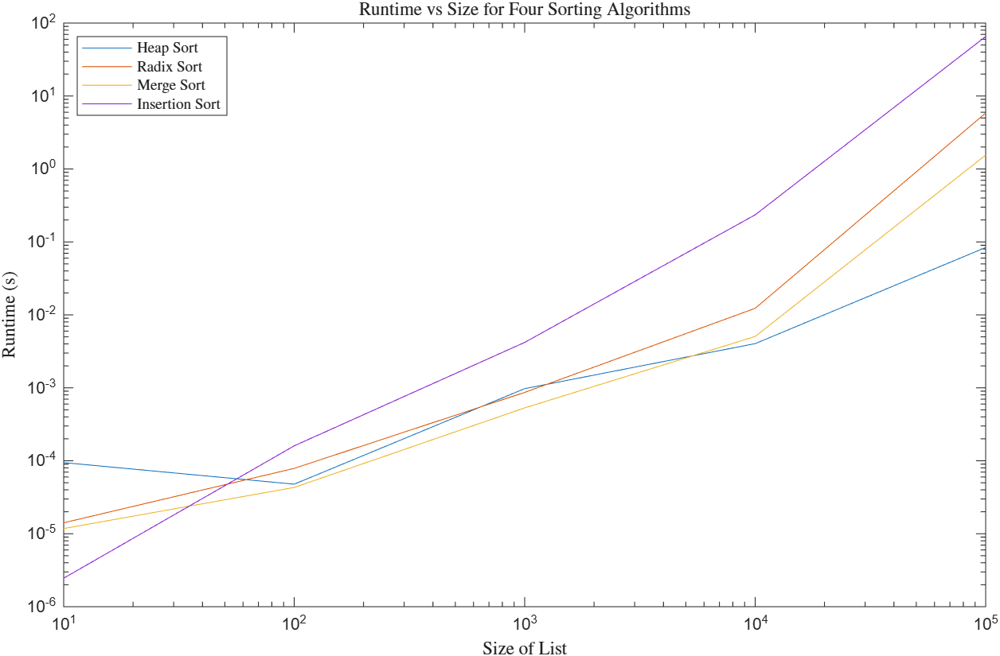
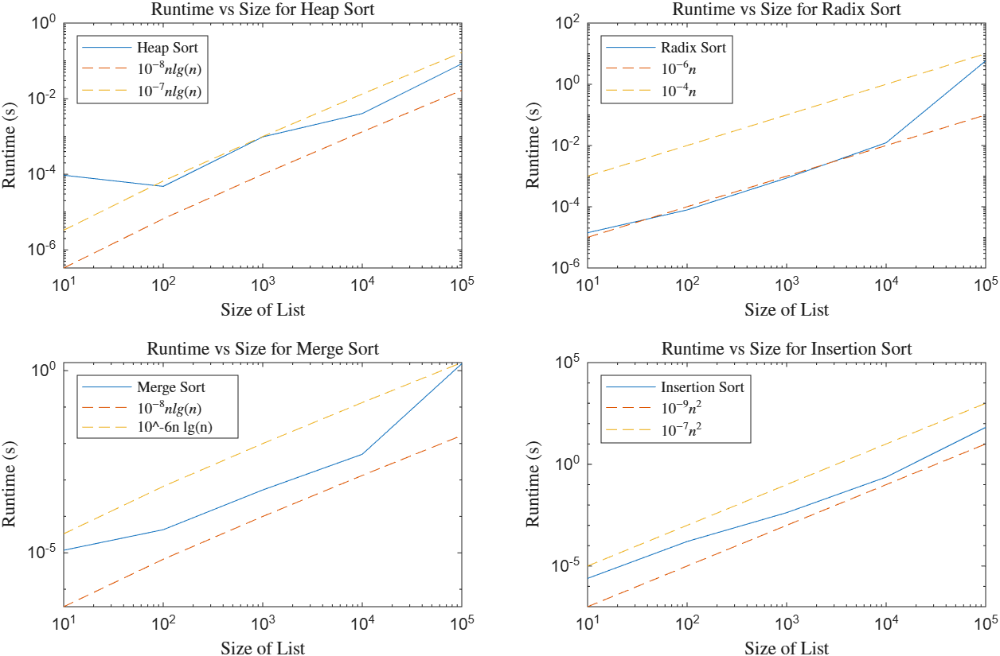

# Sorting Algorithms Writeup

## Introduction

For this assignment, I decided to implement and analyze _Heap Sort_ ( $\Theta(n\ log\ n)$ ),  _Radix Sort_ ( $\Theta(d\times n)$ ), _Merge Sort_ ( $\Theta(n\ log\ n)$ ), and _Insertion Sort_ ( $\Theta(n^2)$ ).  

The code is written in the individual files in the `src/main/kotlin` folder, unit tests are in the `UnitTests.kt` file, and the runtime measurement and CSV conversion are in `Main.kt`. My work on the Master Theorem worksheet is in `master_theorem_worksheet.pdf`, and I made my plots using MATLAB in `plot_complexity.m`  

_Heap Sort_ sorts a list by iteratively adding each element in a list to a min heap, then it removes each element from the heap one by one and reorganizes them into a list. Adding an element to a heap takes $\Theta(log\ n)$ time, as does removing the root element. Both actions occur once per element, meaning both parts of the process take $\Theta(n\ log\ n)$ time, so the process should logically take $\Theta(n\ log\ n)$ time overall.  

_Radix Sort_ sorts a list of integers digit by digit. For the first round, elements are placed into "buckets" based on their least significant digit and put back into a list in that order, effectively ordering them by their least significant digit. The process is then repeated for the next-least significant digit, ordering elements by their second-to-last digit and maintaining the previous order in case of a tie. This is repeated once per digit, until the most significant digit of the largest number has been processed. This process runs through each element for each digit, so the time complexity can be written as $\Theta(d\times n)$ where $d$ is the number of digits on the greatest number.  

_Merge Sort_ sorts a list of integers recursively, by splitting the list into two even-ish parts and reordering them. The list is split into parts until each remaining sub-list has just one element, where each sub-list can already be considered ordered. Then, these ordered lists are re-combined into larger, ordered lists by adding elements one-by-one to the merged list in order. This can be analyzed with the master theorem, written as $T(n)=2T(\frac{n}{2})+n$, and the end behavior shows a runtime of $\Theta(n\ log\ n)$.  

_Insertion Sort_ sorts a list of integers by splitting the list into a sorted and an unsorted part, and swapping elements backwards one-by-one into the sorted part of the list. In a best-case scenario where the list is already sorted, this would take just $\Theta(n)$ time, since it would simply iterate through every element. In the worst-case scenario, a backwards-organized list where each element needs to be shifted as far as possible, it would take $\Theta(n^2)$ time, since each element needs to be shifted across the entire array. This is the slowest approach, and is currently still running on my computer as I type this.

## Methodology

For each sorting algorithm, the runtime was calculated on lists of size 10 through 1,000,000, increasing by a factor of 10 each time. The items in each list are randomly generated, as integers for _Radix Sort_ (since there must be a finite number and countable number of digits) and doubles for all others. This is repeated 5 times for each sorting algorithm at each list size, and the average runtime is found across the 5 trials.  

This gets the average runtimes for each of the four sorting algorithms on numerical lists of sized 10, 100, 1,000, 10,000, 100,000, and 1,000,000. I then plotted them against one another on log-log scale plots to compare them to one another, and then compared them to their big-theta estimates to see how well they hold up.

## Results & Analysis

___Figure 1:___ _The sorting algorithms compared against one another on a log-log scale plot. Insertion Sort is the slowest in the long run, followed by Radix Sort, then Merge Sort, then Heap Sort as the fastest as the list size grows._  

The runtimes determined through testing are shown in Fig. 1. Generally, the results are as expected, with the $\Theta(n\ log\ n)$ algorithms (Heap Sort and Merge Sort) having the smallest runtimes in the long run. Radix Sort is second-to-worst, and expectedly, insertion sort takes the longest. However, that only applues at list sizes of $10^4$ and greater. For 10-element lists, the order is actually reversed, where Insertion Sort takes the least time and Heap Sort takes the most time. The runtimes for most are similar for list sizes of $10^2$ and $10^3$, except for Insertion Sort, which is already noticeably worse.  

The number of digits in each integer used for Radix Sort was not held constant, so the results here are an average for numbers with up to 5 digits. If we know that a list has numbers with many more digits, Radix Sort would be a worse option, but the reverse is a true for a list of numbers with few digits. For a list of digits of a size we don't know, it seems Heap Sort and Merge Sort are the more relaiable algorithms for lists of large sizes.  

___Figure 2:___ _These show the runtimes of each individual algorithm compared to their expected $\Theta$ runtimes, scaled by arbitrary constants. The runtimes are solid lines and the theoretical upper/lower bounds are represented by dashed lines._  

The theoretical runtimes are compared the actual runtimes in Fig. 2. It's possible that some would be more accurate with different constants, but in practice, the only ones that closely followed their expected patterns were Heap Sort and Insertion Sort. Merge Sort and Radix Sort increased in runtime more than anticipated, which may be covered by a greater scaling constant, but it would have been much harder to see on these plots with this data.